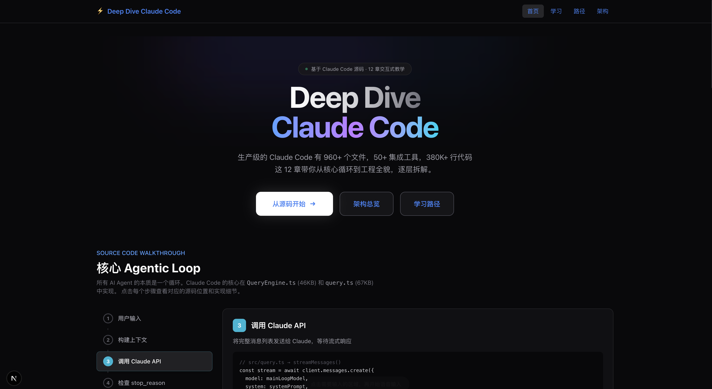
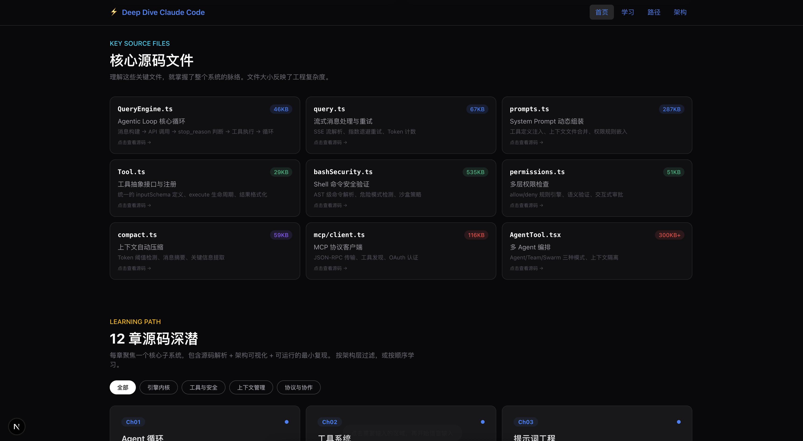
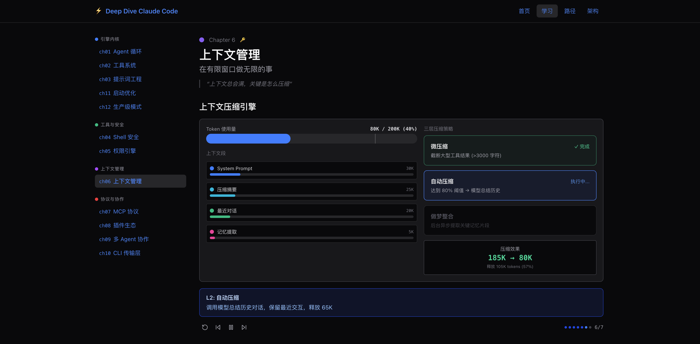

# Deep Dive Claude Code

[English](./README.md) | **中文**

> 生产级的 Claude Code 有 960+ 个文件，50+ 集成工具，380K+ 行代码。
> 这 13 章带你从核心循环到工程全貌，逐层拆解。

**👉 [在线体验](https://deep-dive-claude-code.vercel.app/)**







## 📚 13 章学习路径

```
阶段 1: 核心循环                  阶段 2: 安全体系
========================          ========================
Ch01  Agent 循环          ★★★    Ch04  Shell 安全          ★★★
      所有 Agent 的本质                 300KB+ 安全验证代码
      |                                 |
Ch02  工具系统            ★★☆    Ch05  权限引擎            ★★☆
      50+ 工具注册与分发                每次操作都经过检查
      |
Ch03  提示词工程          ★★☆
      动态组装管线

阶段 3: 上下文与扩展              阶段 4: 协作与工程
========================          ========================
Ch06  上下文管理          ★★★    Ch09  多 Agent 协作       ★★☆
      在有限窗口做无限的事              Agent/Team/Swarm
      |                                 |
Ch07  MCP 协议            ★★☆    Ch10  CLI 传输层          ★☆☆
      统一的工具调用标准                SSE/WS/Hybrid
      |                                 |
Ch08  插件生态            ★☆☆    Ch11  启动优化            ★☆☆
      可扩展的能力边界                  快速路径 + 并行预取
                                        |
                                  Ch12  生产级模式          ★★★
                                        Demo → Production

阶段 5: 隐藏功能
========================
Ch13  隐藏功能            ★★★
      Buddy · Kairos · Ultraplan
      Undercover · Daemon · UDS
```

## 📖 项目简介

本项目基于 [Claude Code](https://github.com/anthropics/claude-code) 的源码，通过 **13 章由浅入深的教学内容**，帮助开发者理解一个**生产级 AI 编程助手**的内部架构和工程决策。

项目包含三个核心部分：

| 部分 | 说明 |
|------|------|
| 📖 **深度文档** (`docs/`) | 13 篇源码解析文档，每章聚焦一个核心子系统 |
| 💻 **可运行演示** (`agents/`) | 12 个 TypeScript 演示程序，每个可独立运行 |
| 🌐 **交互式学习平台** (`web/`) | Next.js Web 应用，含可视化、模拟器、源码查看器 |

## 📋 章节目录

| 章 | 标题 | 格言 | 关键源码 |
|----|------|------|----------|
| [Ch01](./docs/ch01-agent-loop.md) | Agent 循环 | *所有 Agent 的本质是一个循环* | `QueryEngine.ts` + `query.ts` |
| [Ch02](./docs/ch02-tool-system.md) | 工具系统 | *注册一个 handler 就多一种能力* | `Tool.ts` + `tools.ts` |
| [Ch03](./docs/ch03-prompt-engineering.md) | 提示词工程 | *System Prompt 是动态组装的管线* | `prompts.ts` + `claudemd.ts` |
| [Ch04](./docs/ch04-bash-security.md) | Shell 安全 | *最强大的工具需要最严密的防护* | `bashSecurity.ts` + `bashParser.ts` |
| [Ch05](./docs/ch05-permissions.md) | 权限引擎 | *权限不是事后添加的，是架构的骨架* | `permissions.ts` + `filesystem.ts` |
| [Ch06](./docs/ch06-context-management.md) | 上下文管理 | *上下文总会满，关键是怎么压缩* | `compact.ts` + `SessionMemory/` |
| [Ch07](./docs/ch07-mcp-protocol.md) | MCP 协议 | *MCP 让任何服务都能成为 AI 的工具* | `mcp/client.ts` + `mcp/auth.ts` |
| [Ch08](./docs/ch08-plugin-ecosystem.md) | 插件生态 | *插件是能力的乘法器* | `pluginLoader.ts` |
| [Ch09](./docs/ch09-multi-agent.md) | 多 Agent 协作 | *规模化来自分工，不是更大的上下文* | `AgentTool.tsx` + `swarm/` |
| [Ch10](./docs/ch10-cli-transport.md) | CLI 传输层 | *传输层决定 Agent 能在哪里运行* | `cli/transports/` |
| [Ch11](./docs/ch11-bootstrap.md) | 启动优化 | *快速路径决定体验，完整路径决定能力* | `dev-entry.ts` → `cli.tsx` → `main.tsx` |
| [Ch12](./docs/ch12-production-patterns.md) | 生产级模式 | *让 Agent 可靠运行需要十倍工程量* | `sessionStorage.ts` + `analytics/` |
| [Ch13](./docs/ch13-hidden-features.md) | **隐藏功能** | *每一行 feature('FLAG') 背后都是产品决策* | `buddy/` + `ultraplan.tsx` + `undercover.ts` |

## 🚀 快速开始

### Web 学习平台（推荐）

```bash
cd Deep-Dive-Claude-Code/web
npm install
npm run build    # 编译文档 + 源码 + 构建
npm run dev      # http://localhost:3200
```

每个章节页面包含 4 个 Tab：
- **可视化** — 交互式步进动画（13 个独立可视化组件）
- **模拟器** — Agent 循环消息流回放（13 个场景数据）
- **源码** — 关键代码片段（TypeScript 语法高亮）
- **深入** — 完整 Markdown 文档渲染

首页核心源码文件卡片**可点击跳转到源码预览页**，支持搜索高亮。

### 命令行演示

```bash
cd Deep-Dive-Claude-Code
npm install
npx tsx agents/s01_agent_loop.ts    # 需要 API Key
npx tsx agents/s04_bash_security.ts # 无需 API Key，推荐试试
```

## 🛠️ 技术栈

### 学习平台 (web/)

| 技术 | 说明 |
|------|------|
| **Next.js 15** | React 框架，App Router |
| **Tailwind CSS 4** | 暗色主题 |
| **Framer Motion** | 交互式动画 |
| **Lucide React** | 图标库 |
| **unified + remark + rehype** | Markdown 渲染管线 |

### 被解析的项目 (Claude Code)

| 层次 | 技术 |
|------|------|
| 运行时 | Bun 1.3.5+ |
| 语言 | TypeScript (~960 个 .ts/.tsx 文件) |
| 终端 UI | React Ink |
| CLI 框架 | Commander.js |
| 工具协议 | MCP (Model Context Protocol) |
| A/B 测试 | GrowthBook |
| 编译时消除 | `feature()` 宏 (bun:bundle) |

## 🙏 致谢

本项目的诞生离不开以下开源项目和社区贡献：

- **[claude-code-rev](https://github.com/oboard/claude-code-rev)** — Claude Code 源码还原项目，提供了完整的 TypeScript 源码，支持本地编译运行。本项目分析的所有源码均来源于此。
- **[claw-code](https://github.com/instructkr/claw-code)** — Claude Code 源码解析先驱，提供了优秀的源码分析思路和文档参考。
- **[claudecode-src Wiki](https://cnb.cool/nfeyre/claudecode-src/-/wiki)** — 完整的 Claude Code 源码逐文件解析 Wiki，覆盖每个模块的详细注释和分析。
- **[learn-claude-code](https://github.com/shareAI-lab/learn-claude-code)** — 交互式 Agent 教学项目，本项目的 Web 学习平台（步进可视化 + Agent 模拟器 + 源码查看器）的交互模式受其启发。

感谢以上项目的作者和贡献者们！
